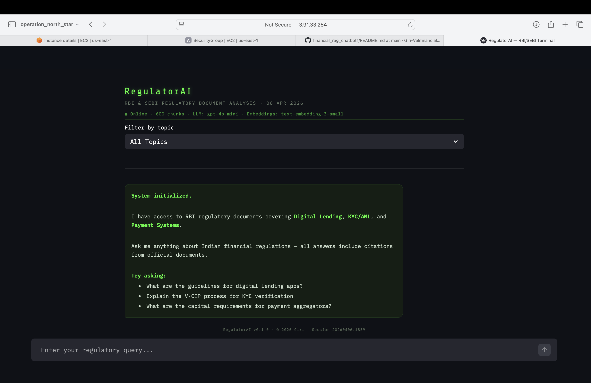
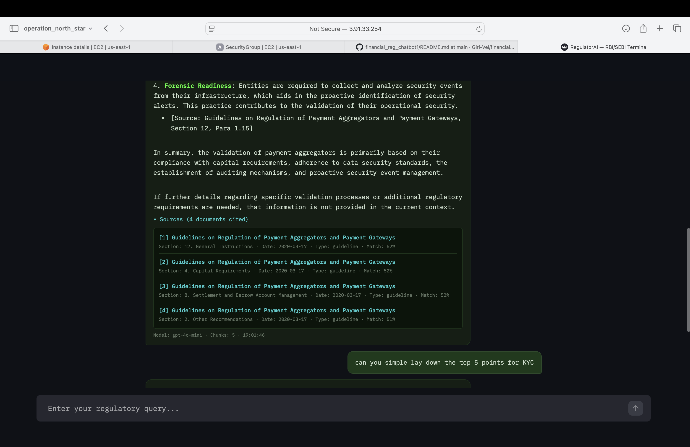

<p align="center">
  <h1 align="center">RegulatorAI</h1>
  <p align="center">
    AI-powered assistant for navigating Indian financial regulations.
    <br />
    Ask questions about RBI & SEBI regulatory documents — get cited answers backed by official sources.
  </p>
</p>

<p align="center">
  
  
  
  
  
  
  
  
  
</p>

---

## What is RegulatorAI?

RegulatorAI is a RAG (Retrieval-Augmented Generation) chatbot that lets you query Indian financial regulatory documents in plain English. Instead of manually searching through lengthy RBI Master Directions, circulars, and guidelines, you ask a question and get a structured answer with citations pointing back to the exact source document, section, and paragraph.

The system currently covers **10 RBI documents** across three regulatory topics — Digital Lending, KYC/AML, and Payment Systems — with ~600 embedded chunks powering the retrieval.

## Screenshots

### Homepage
The terminal-style interface showing system status, topic filters, and suggested queries.

<p align="center">
  
</p>

### Query in Progress
User asks a question and sees the loading state while the RAG pipeline processes.

<p align="center">
  
</p>

### Response with Citations
The assistant returns a detailed answer with inline source citations.

<p align="center">
  
</p>

### Source Documents
Expandable source panel showing which documents were cited, with relevance scores.

<p align="center">
  
</p>

## Architecture

```
RBI/SEBI Documents (PDFs, HTML)
        │
        ▼
┌─────────────────────────────────────────────────┐
│            Ingestion Pipeline                    │
│  Scraper → Parser → Chunker → Embedder          │
└─────────────────────────────────────────────────┘
        │
        ▼
┌──────────────────────┐     ┌──────────────────────┐
│     ChromaDB         │     │     OpenAI API        │
│  600 chunks          │────▶│  gpt-4o-mini          │
│  cosine similarity   │     │  text-embedding-3     │
└──────────────────────┘     └──────────────────────┘
        │
        ▼
┌──────────────────────┐
│   FastAPI Backend     │
│  RAG chain            │
│  4 API endpoints      │
└──────────────────────┘
        │
        ▼
┌──────────────────────┐
│   Streamlit UI        │
│  Chat interface       │
│  Source citations      │
└──────────────────────┘
```

### How it works

1. **Ingestion** — Regulatory documents are scraped from RBI sources (with mirrors for bot-protected URLs), parsed from PDF/HTML into structured text, split into ~1000-character chunks with section-aware boundaries, and embedded using OpenAI's `text-embedding-3-small` model into ChromaDB.

2. **Retrieval** — When a user asks a question, the query is embedded and matched against the 600 stored chunks using cosine similarity. The top 5 most relevant chunks are retrieved, filtered by a minimum similarity threshold of 0.3.

3. **Generation** — The retrieved chunks are formatted into a context prompt with document metadata (title, section, date, regulator). This context plus the user's question is sent to `gpt-4o-mini` with instructions to cite specific documents and sections in the answer.

4. **Serving** — FastAPI exposes the RAG chain through a REST API (`POST /query`, `GET /health`, `GET /topics`, `GET /documents`). The Streamlit frontend calls these endpoints and renders responses in a WhatsApp-style chat interface with expandable source citations.

## Tech Stack

| Layer | Technology | Why |
|-------|-----------|-----|
| **LLM** | OpenAI gpt-4o-mini | Cost-effective for Q&A at this scale, strong instruction following for citations |
| **Embeddings** | OpenAI text-embedding-3-small | Good quality-to-cost ratio, 1536 dimensions |
| **Vector Store** | ChromaDB | Local, free, no external dependency, persistent storage |
| **RAG Framework** | LangChain | Flexible chain composition, good OpenAI/ChromaDB integration |
| **Backend** | FastAPI | Async, auto-generated docs, Pydantic validation |
| **Frontend** | Streamlit | Rapid prototyping, custom HTML rendering for chat UI |
| **Document Processing** | PyMuPDF + BeautifulSoup | PDF text extraction + HTML parsing |
| **Containerization** | Docker Compose | Two-container architecture (API + UI), health checks |
| **Cloud** | AWS EC2 (t2.micro) | Free tier, deployed and tested live |

## Knowledge Base

| Topic | Documents | Chunks | Key Regulations |
|-------|-----------|--------|-----------------|
| Digital Lending | 3 | ~180 | Guidelines on Digital Lending (2022), Digital Lending Directions (2025), FAQs |
| KYC / AML | 5 | ~340 | KYC Master Direction (2016, updated 2025), V-CIP circulars, KYC FAQs |
| Payment Systems | 2 | ~80 | PPI Master Direction, Payment Aggregator Guidelines |

## Quick Start

### Prerequisites

- Docker and Docker Compose installed
- An OpenAI API key

### Setup

```bash
# Clone the repository
git clone https://github.com/Giri-Vel/financial_rag_chatbot1.git
cd financial_rag_chatbot1

# Create your .env file
cp .env.example .env
# Edit .env and add your OPENAI_API_KEY

# Run the ingestion pipeline (first time only — downloads docs, parses, chunks, embeds)
pip install -e .
python scripts/ingest.py

# Start the application
docker compose up --build -d
```

The UI will be available at `http://localhost:8501` and the API docs at `http://localhost:8000/docs`.

### API Endpoints

| Method | Endpoint | Description |
|--------|----------|-------------|
| `POST` | `/api/v1/query` | Ask a regulatory question, get a cited answer |
| `GET` | `/api/v1/health` | Health check with collection stats |
| `GET` | `/api/v1/topics` | List available topics with chunk counts |
| `GET` | `/api/v1/documents` | Full knowledge base inventory |

### Example Query

```bash
curl -X POST http://localhost:8000/api/v1/query \
  -H "Content-Type: application/json" \
  -d '{"question": "What are the capital requirements for payment aggregators?"}'
```

## Project Structure

```
financial_rag_chatbot1/
├── data/
│   └── document_registry.json      # Source URLs and metadata for all documents
├── scripts/
│   └── ingest.py                    # Full ingestion pipeline runner
├── src/
│   ├── config.py                    # Central config + prompt templates
│   ├── api/
│   │   ├── main.py                  # FastAPI app with lifespan
│   │   ├── routes.py                # All endpoint logic
│   │   └── models.py                # Pydantic request/response schemas
│   ├── ingestion/
│   │   ├── scraper.py               # Document downloader with retry logic
│   │   ├── parser.py                # PDF/HTML text extraction
│   │   ├── chunker.py               # Section-aware text splitting
│   │   └── embedder.py              # OpenAI embeddings → ChromaDB
│   ├── retrieval/
│   │   └── vector_store.py          # ChromaDB search interface
│   └── generation/
│       └── chain.py                 # RAG chain: retrieve → format → generate
├── ui/
│   └── app.py                       # Streamlit chat frontend
├── Dockerfile.api                   # API container
├── Dockerfile.ui                    # UI container
├── docker-compose.yml               # Two-container orchestration
├── pyproject.toml                   # Dependencies and project config
└── .env.example                     # Environment variable template
```

## Design Decisions

- **Two Docker containers over one** — Keeps the UI lightweight (only Streamlit + requests) and the API self-contained with the full RAG stack. Better separation of concerns and cleaner for the portfolio.

- **ChromaDB over Pinecone** — Local, free, no external dependency. At 600 chunks, a managed vector DB would be overkill. ChromaDB data is mounted as a Docker volume for persistence.

- **OpenAI over open-source models** — At this project's scale, OpenAI API costs are negligible (~$0.01 per query). The focus is on the RAG pipeline architecture, not model hosting.

- **Section-aware chunking** — Instead of blindly splitting text every N characters, the chunker respects document structure (chapters, sections, numbered paragraphs). Each chunk carries rich metadata (regulator, topic, doc_type, section_title, date) enabling filtered retrieval.

- **Custom HTML chat bubbles** — Streamlit 1.55.0 has broken rendering for `st.chat_message()` avatars and `st.expander()` icons. Workaround uses custom HTML divs for WhatsApp-style bubbles and `<details>/<summary>` for expandable source citations.

- **Mirror URLs for RBI documents** — `rbidocs.rbi.org.in` returns HTTP 418 (bot protection) for automated requests. The document registry uses mirrors from RBI's commonman portal, DigiLocker CDN, and other government sources.

## Roadmap

- [ ] SEBI document ingestion (currently RBI only)
- [ ] Evaluation pipeline with 20-30 Q&A pairs and retrieval/answer quality metrics
- [ ] Additional RBI topics beyond digital lending, KYC, and payment systems
- [ ] Improved markdown rendering in chat bubbles (numbered lists, tables, headers)
- [ ] SSL/domain setup for production deployment
- [ ] Auto-scroll to latest message

## License

MIT — see [LICENSE](LICENSE) for details.

---

Built by [Giri](https://github.com/Giri-Vel) as part of a portfolio project exploring RAG pipelines for financial services.